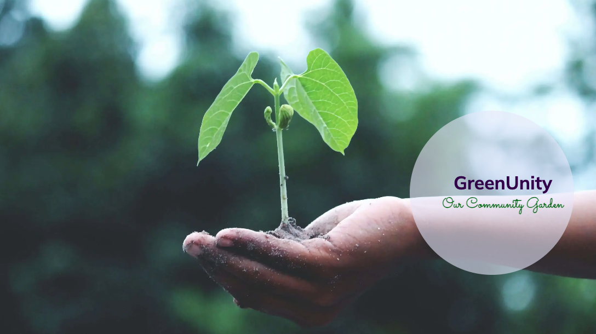
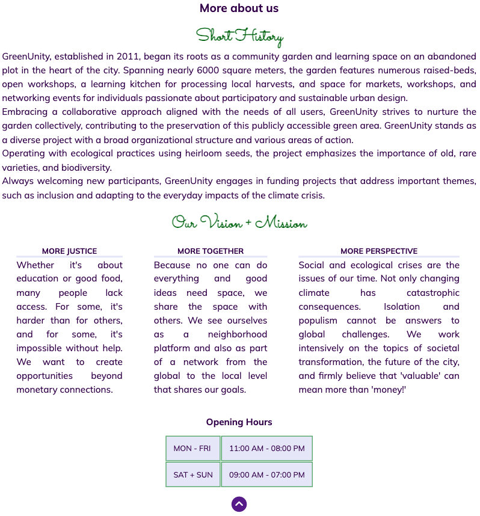
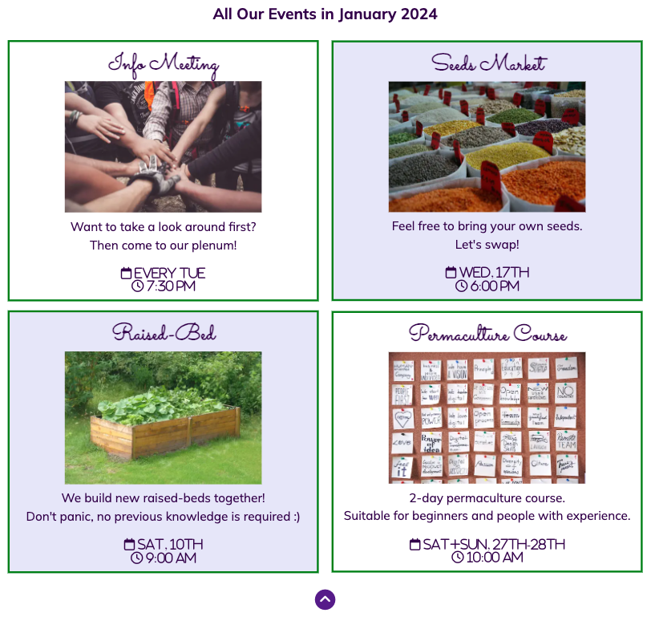
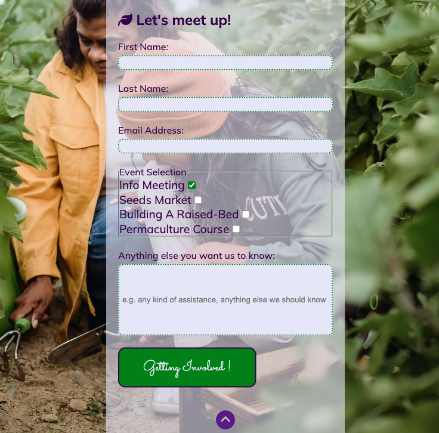
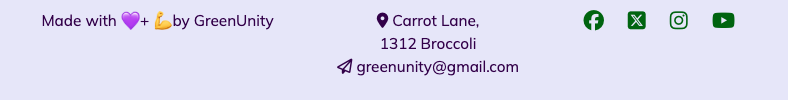

# :purple_circle: *GreenUnity* :purple_circle:

Welcome to GreenUnity's homepage – the heart of our community garden. Discover a space where nature and community intertwine, offering hands-on gardening experiences, educational opportunities, and a sense of belonging. The homepage is the gateway to a thriving community committed to sustainable living and shared knowledge. Explore the value of being a part of GreenUnity, where you can cultivate not only plants but also lasting connections and a richer understanding of the environment. 

🌱 The deployed page can be found [here](https://zabokaa.github.io/GreenUnity/) 🍃

## Table of Contents

- [Objective](#objective)
- [Key Features](#key-features)
- [User Stories](#user-stories)
- [UX Design Five Planes Method](#ux-design-five-planes-method)
- [Testing](#testing)
  - [Manual](#manual)
  - [Official Validators](#official-validators)
  - [Unfixed Bugs](#unfixed-bugs)
- [Technologies](#technologies)
- [Deployment](#deployment)
- [Project Status](#project-status)
- [Acknowledgements](#acknowledgements)

## Objective

- to build a responsive 1-page web app for a Community Garden
- low-threshold access for users without social media accounts
- to use tracking pixel to simulate client-side tracking and a postback URL to simulate server-side tracking

## Key Features

- Header

  
  - **Logo:** A plain logo that is fitting to the overall clean design of the page, that is functioning as navigating back to the home section. 
  - **Menu Navigation:** The page features an intuitive menu for easy navigation, allowing users to access different sections.

- Hero Section (=Home)

  
  - **Text-Only Display for Mobile:** Events are presented in a text-only format on mobile devices --> enhance readability and user experience.
  - **Image Display for Tablet and Laptop:** Events are showcased with pictures on tablet devices and arranged in two-per-row format for laptops.

- About Us Section
  
  
  - **Community Garden Development:** Users can find information about the development of the community garden -->  transparency and engagement.
  - **Vision and Mission:** A dedicated section outlines the vision and mission of the community, providing users with a deeper understanding of its purpose.
  - **Opening Hours:** Clear details about the operating hours are available for user convenience.
 
- Events Section
  
  
  - **Monthly Events:** Users can easily access info about events scheduled for the current month.
  - **Additional Information:** Each event is displayed in a own box, featuring name of the event, a representative image (not for mobile size screens, because it would decrease the readability), a short description, date, and time.

- Getting Involved Section
  
  
  - **Event Enrollment:** Users can enroll in one or more events by providing their names and email addresses.
  - **Additional Information:** Users have the option to include additional details, such as special assistance requirements --> better communication and event coordination.

- Footer
  
  
  - **Comprehensive Footer:** The footer contains essential information, including the address, a brief impressum, and links to social media.
  - **New Tab Links:** Social media links open in new tabs, ensuring users remain on my page.

- Responsive Design
  - **Responsive Design:** The webpage follows a mobile-first approach, ensuring optimal user experience across various devices. All images above are for screen size tablet.
  - **Differences for Mobile Screen:**
    - Burger Menu for Navigation
    - Smaller and more centric positon of hero text
    - Content of About Us section is in one column
    - Event-Boxes are in one column, as already mentioned without image, and with changing background color. 
    - Content of footer is centered in one column
    - The headings are on the left because it is clearer and analogous to the reading direction.
  - **Differences for Tablet Screens:**
    - The vision + mision part of the about us section is alternating left- and right-aligned
    - Eventboxes are centered in one column, with images. 

- Quick Navigation
  - **Arrows for Scroll Navigation:** Arrows below each section enable users to quickly navigate to the top of the page.
 

## User Stories

- Responsive Experience
  - As a user, I expect a consistent and responsive design for easy use on various devices, prioritizing mobile devices first.

- Event Enrollment
  - As a user, I want a simple event enrollment process.
  - As a user, I need to enroll in multiple events efficiently, providing additional details like special assistance requirements.

- Quick Navigation
  - As a user, I need quick navigation between sections using arrow buttons for efficient browsing.

- Information Access
  - As a user, I want easy access to technical details about the community garden, including history of the community, vision, mission, opening hours, and current month's events.
  - As a user with a visual impairment, I want to use an application that is compatible with a screen reader so that I can get all info.

- Footer Information
  - As a user, I find value in the footer for critical information, including the address, a concise impressum, and social media links set to open in new tabs for a seamless experience.

 
## UX Design Five Planes Method

- Strategy
  - The page is of value for new users (getting information) as well as for the members of GreenUnity (getting information too, and attracting new members)
  - It is a way to reach out to users that are not using social media, e.g. instagram.
- Scope
  - The user wants to have access to different sections via menu without scrolling down. The links in the menu are self-explanatory.
- Structure
  - The page is structured in such a way that 1. it goes from the general to the more specific and 2. from a passive to an active integration of the user
  - First a rough historical outline, then more specific or concrete vision and mission.
  - The next section is events, which are even less abstract.
  - Then the user can register for an event. 
- Skeleton
  - My first concept was not having a 1-page site, but different html pages for each section. But since it is more common today, and users are more used to that, I changed that.
  - [Here](./assets/img/readme-img/Flowerbeds_wireframes_1.pdf) you can find my wireframes, designed with Balsamiq. (Pls note that I changed the name of the Community Garden from Flowerbeds to GreenUnity, because with GreenUnity both nature and community are associated.)
- Surface
  - The hero image is a symbol for planting something with your own hand. 
  - The primary colors are green and lavender. Green symbolizes plants and nature, and lavender has a strong connection to flowers and spring, and therefore to a transition. The text-color is a dark purple (related to lavender) and used to have a smoother contrast to white or lavender background than black.
  - I chose italic as the second font because it looks more personal and handmade. It goes well with the planting and getting involved approach of the site. 

## Testing

### Manual

  - Page is responsive (menu, images, style of each section) for tablet, laptop, and wide screens
  - Menu working, going up arrow after each section working as well
  - All links working and opening in a new tab
  - All images have alt text or fallback background color and aria-labels are there
  - Contrast ratio (WCAG AAA) passed

### Official Validators

  - [W3C HTML Validator](./assets/img/readme-img/html_validation.png): No errors 
  - [W3C CSS Validator](./assets/img/readme-img/CSS_validation.png):  First I had an error because my img tags in the events section had a size attribute without a srcset atrribute --> fixed: no errors 
  - [Lighthouse Chrome DevTools](./assets/img/readme-img/lighthouse_afterResizingImg.png): Values for accessibility / best practise / SEO all 100, increased performance value from 74 to 99 by transforming and resizing all my images 
  - [WAVE](./assets/img/readme-img/wave_validation.png): No errors for accessibility and color contrast
 
### Unfixed Bugs
  
  - On mobile phones, the dropdown menu in the navigation covers the page content, preventing the user from immediately seeing the top of that specific section. To address this issue, they must close the menu. Imo, this cannot be fixed using vanilla HTML alone.

## Technologies

HTML | CSS

## Deployment

- The site is deployed on Github Pages.

  HOW TO: 

  1. **Go to Repository Settings:**
     In your GitHub repository, navigate to the "Settings" tab.
  
  2. **Scroll Down to GitHub Pages Section:**
     In the Settings, scroll down to the "GitHub Pages" section.
  
  3. **Choose Your Source Branch:**
     Under "Source," select the branch you want to use for GitHub Pages (e.g., `main`).
  
  4. **Save Your Changes:**
     Save the changes. GitHub Pages will provide you with a link to your deployed site.
  
  5. **Wait for the Build:**
     GitHub Pages will now build and deploy your site. Wait for the process to complete.
  
  6. **Access Your Deployed Site:**
     Once the build is successful, you can access your deployed site using the provided link.

  Your project is now live on GitHub Pages! 

## Project Status

Project is: finished

## Acknowledgements

This project was based on full-stack course @ Code Institute.

- Image of raised-bed from  wikimedia.com, all other images from pexels.com
- Images edited with squoosh.app
  
